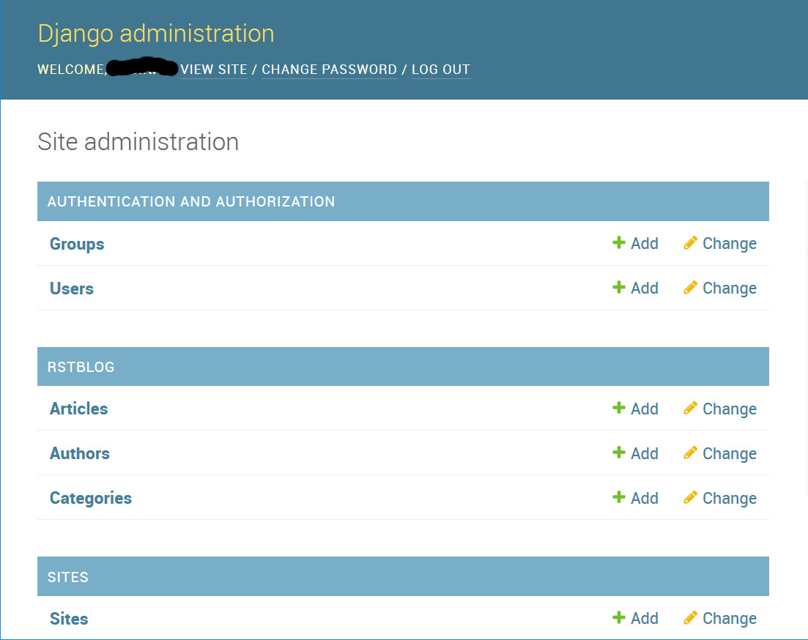
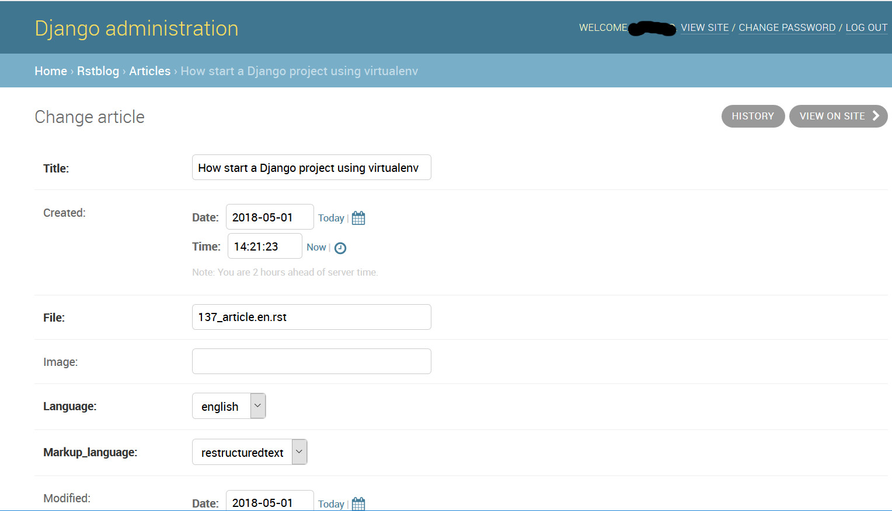

.. _manager manual:

########################
Site manager manual
########################

.. contents:: *site manager manual* table of contents
   :depth: 3

Ok, so you are the manager of a website that uses ``diango-rstblog`` to
publish articles from an author.

As a site administrator it is expected that you know how to carry out
the operations necessary to ensure the operation of the site, from
its installation, to routine activities during its operation.

We'll see this operations in the following chapters.

Installing ``diango-rstblog``
================================

Prerequisites
---------------

Hereafter we assume you already have a Django project currently running.
Probably, even if not necessarly, it is installed using a virtualenv_. If
this is true, activate it before to do the operations here described.

And we assume that you are going to install in a computer having an
Internet connection.

Please, be sure to use a Python version 3.6 or newer, and a Django version 2.0
or newer.

Through the Internet connection, the Python installer (pip) will  
upload ``django-rstblog`` and all of its dependencies:

* ``docutils``;
* ``django-concurrency``;
* ``Markdown``;
* ``Pygments``;
* ``python-markdown-math``.

Installing
----------------

First of all, install ``diango-rstblog``::

    pip install django-rstblog
    
Then:
    
1. In your project ``setting.py`` file:

    1.1. Add ``rstblog`` to your INSTALLED_APPS like [1]_ this::

        INSTALLED_APPS = [
            ...
            'django.contrib.sites',       # django's sites framework    
            'fullurl',                    # django-fullurl
            ...
            'rstblog',
        ]
    
    1.2. check for presence of login parameters::

        ...
        LOGIN_REDIRECT_URL = '/' # It means home view
        LOGIN_URL = '/login/'
        ...
    
    1.3. Add a RSTBLOG configuration section like this::
    
        ...
        RSTBLOG = {
            'ARTICLES_DIR': os.path.join(BASE_DIR, "contents", "articles"), 
            'START_CONTENT_SIGNAL': '.. hic sunt leones',     # BEWARE: string on a single line, without other characters
            'languages': { 'en': 'englis',                   # 1st position is default language (functioning on py 3.6+)
                           'it': 'italian', },
            'types': { 'article': 'article',                  # 1st position is default type (ok on py 3.6+)
                       'page': 'page', },
            'FIELDS': {'markup',
                       'image',
                       'atype',
                       'language',
                       'title',
                       'created',
                       'modified',
                       'slug',
                       'category',
                       'published',
                       'offer_home',
                       'summary',
                       'authors',
                       'translation_of', },
            'LIST_FIELDS': {'authors',},
            'DT_FIELDS': { 'created',
                           'modified', },
            'BOOL_FIELDS': { 'published',
                             'offer_home', },
            'HOME_ITEMS': 10,
        }
        ...
    
    1.4 check for presence of SITE_ID::
    
        ...
        SITE_ID = 1
        ...

2. In your project urls.py file:

    2.1. include the ``rstblog`` URLconf::

        from django.urls import include
        ...
        path('blog/', include('rstblog.urls', namespace='rstblog')),
        ...
    
    2.2. check for presence of login url::

        from django.contrib.auth     import views as auth_views
        ...
        path('login/', auth_views.LoginView.as_view(), name='login'),
        path('logout/', auth_views.LogoutView, {'next_page': settings.LOGIN_REDIRECT_URL}, name='logout'), 
        ...

3. About your project templates:

    3.1. they must have a ``base.html`` template with this blocks
    used from rstblog templates::
    
        
        
        
        
    
    3.2. check for the presence of ``templates/registration/login.html``
    used in login.
    
4. In your project directory (where live manage.py), create the 
   directory ``contents/articles``

5. Run ``python manage.py migrate`` to create  the ``django-rstblog`` models.

6. Restart the http service and visit ``https://your-domain/admin/`` [2]_ [3]_
   to create at least a ``Category`` with value **uncategorized** to load articles [4]_.
   
7. Visit ``https://your-domain/blog/`` to show an empty list of articles.
   
8. Prepare an article on your PC as this one::

    :markup:   restructuredtext
    :title:    article
    :language: en
    :slug:     article
    :category: uncategorized
    
    .. hic sunt leones
    
    =========
    Article
    =========
    
    This is the article content.
    
    And this is a secod paragraph of the article.

9. Visit ``https:/your-domain/blog/load-article`` to load the previous article.

10. Now, if you visit again ``https://your-domain/blog/`` you get a list with
    an article, and if you click on title, you'll show it
    (url: https://your-domain/blog/show/article)

Base architecture
===================

Here we'll spend two words about how ``django-rstblog`` works.

It uploads articles in a directory as follows [5]_::

  /usr/share/nginx/html/project/site/contents/articles
  
Usually there is at least another directory, to upload other media files:

  /usr/share/nginx/html/project/site/contents/media
  
When a user uploads an article, ``django-rstblog`` loads it in the
aforesaid directory (``.../articles``), then it reads the lines that
categorize the article (its fields) and it updates consequently the 
database tables. If we have a new article: it inserts new records,
otherwise it updates the existings ones.

So, user has only one basic operation available: ``load-article``, available
at URL: ``https://your-domain/blog/load-article``

Available URLs
-----------------

Here are the URLs available by ``django-rstblog``, that is its functions:

* ``blog/``, it shows the newer articles; allowed to all users, even anonymous;
* ``blog/index/``, it shows all the articles; allowed to all users, even anonymous;
* ``blog/index/<category>``, it shows all articles of indicated category; allowed to all users, even anonymous;
* ``blog/load-article``, it (re)uploads an article; allowed to known users, *not* anonymous;
* ``blog/reset-article-table``, it rebuilds the DB contents from articles loaded in filesystem;
   allowed to known users, *not* anonymous;
* ``blog/show/<slug>``, it shows the article of indicated slug; allowed to all users, even anonymous;
* ``blog/stats``, it shows the django-rstblog statistics;  allowed to all users, even anonymous.

Administering
===============

.. note:: DB administration is a site functionality, not a ``django-rstblog`` one.

   ``django-rstblog`` declares its DB structures, so the Django's administration
   can manage them.
   
   So this function isn't listed between the previous showed URLs,
   and the request URL is ``https://your-domain/admin``,
   **not** ``https://your-domain/blog/admin``.

Author and Categories
----------------------

To manage author(s) and categories recognized by ``django-rstblog``
it's necessary to store their values in the project database.

To do so, call ``https://your-domain/admin/``. If you aren't logged in, the
site will ask your username and password. Type them (this account must have
adminstrative privileges) and you'll get the admin interface to database
as follow:

To manage authors and categories you can click on these items showed in
the *RSTBLOG* section of the previous image.

User interface to operate this tasks is straightforward, so we don't bother you
showing it.

User
--------

An author of articles needs an account to upload articles. So you may have to 
create one or more (in case of more authors publishing in the same blog)
accounts.

You can create accounts using the item *Users* at the section
*AUTHENTICATION AND AUTHORIZATION*.

This voice is useful even in case you need to change user's password: edit the
user that have requested it.

Articles administration
===========================

Deleting an article
-----------------------

As you can see, delete an article now isn't a function of ``django-rstblog``.
So if a user wants absolutly to erase an article he/she must ask you to do
it, as site master.

How can you do it? With two steps:

* erase the record about the article;
* then delete the relative file in filesystem.

About the first step: be sure to delete the right record. Double check
title **and filename** of the article.

If you have only the title and/or the slug, you can retrieve the filename
reading it in the record of the article as in the image below (it is the field
titled **File**):

About the second step. It's required because in case of `Articles table reconstruction`_
(see below) the presence of the articles file recreates its record ...

Changing an article filename
------------------------------

This is another operation not allowed to the author. In case of a request
from the author to change an article filename you must:

* change the filename in the record of the article (see the previous image);
* rename the file of the article in the server filesystem;
* tell the author to rename his/her filename in the authoring PC filesystem.

Articles table reconstruction
---------------------------------

If needed it is possible force a complete *Articles table* reconstruction.

If you call URL ``.../blog/reset-article-table``, ``django-rstblog`` will
erase all records in *Articles table*, then it will rebuild it reading
all files present in directory ``.../contents/articles``.

Configuring
==============

``django-rstblog`` uses setup parameters from the django project's ``settings.py``.

Notably it reads the dictionary named ``RSTBLOG`` with this structure:

.. code:: python

  RSTBLOG = {
      'ARTICLES_DIR': os.path.join(BASE_DIR, "contents", "articles"), 
      'START_CONTENT_SIGNAL': '.. hic sunt leones',     # BEWARE: string on a single line, without other characters
      'languages': { 'en': 'english',                    # 1st position is default language (functioning on py 3.6+)
                     'it': 'italian', },
      'types': { 'article': 'article',                  # 1st position is default type (ok on py 3.6+)
                 'page': 'page', },
      'FIELDS': {'markup',
                 'image',
                 'atype',
                 'language',
                 'title',
                 'created',
                 'modified',
                 'slug',
                 'category',
                 'published',
                 'offer_home',
                 'summary',
                 'authors',
                 'translation_of', },
      'LIST_FIELDS': {'authors',},
      'DT_FIELDS': { 'created',
                     'modified', },
      'BOOL_FIELDS': { 'published',
                       'offer_home', },
      'HOME_ITEMS': 10,
  }
  
Let's see the parameters in ``RSTBLOG``.

ARTICLES_DIR
-----------------

Directory containing the articles. Usually it is the directory:
``project-base-dir/contents/articles``.

.. warning:: If you wish to change this parameter,
   test the new value extensively. This is because it is possible
   have links in article relative from this directory to media directory.
   
   So maybe necessary move the two directories in pairs.

*Type*: string.

START_CONTENT_SIGNAL
----------------------

This is the signal used from ``django-rstblog`` to discern the fields part
of the article, from its contents.

You can change it, but keep it homogeneous: you cannot have some articles
with one signal and other articles with another one.

*Type*: string.

languages
----------------------

The list of the human languages used to write articles. It is a dictionary,
and its first introduced key is the default language.

Authors must use *language key* to declare the used language in the article.

*language value* is displayed in html windows returned from ``django-rstblog``
to browser.

.. note:: Insert order in dictionary is assured using Python v.3.6+.

   This is the reason that requires the use of Python v.3.6+.

*Type*: dictionary.

*Example*:

.. code:: python 
    
   ...
   'languages': { 'en': 'english',     # 1st pos.is default language (functioning on py 3.6+)
                  'it': 'italian', },
   ...

types
----------------------

The list of types managed from ``django.rstblog``. This is a **reserved**
dictionary, please don't change it.

*Value*: it must be:

.. code:: python 

   ...
   'types': { 'article': 'article',                  # 1st position is default type (ok on py 3.6+)
              'page': 'page', },

FIELDS
----------------------

The list of fields managed from ``django.rstblog``. This is a **reserved**
set, please don't change it.

*Value*: it must be:

.. code:: python 

   ...
   'FIELDS': {'markup',
              'image',
              'atype',
              'language',
              'title',
              'created',
              'modified',
              'slug',
              'category',
              'published',
              'offer_home',
              'summary',
              'authors',
              'translation_of', },

LIST_FIELDS
----------------------

The list of fields managed from ``django.rstblog`` that are fields. This is a **reserved**
set, please don't change it.

*Value*: it must be:

.. code:: python 

   ...
   'LIST_FIELDS': {'authors',},

DT_FIELDS
----------------------

As above about the datetime fields. Again: this is **reserved**, don't alter it.

*Value*: it must be:

.. code:: python 

   ...
   'DT_FIELDS': { 'created',
                  'modified', },

BOOL_FIELDS
----------------------

As above about the boleean fields. Again: this is **reserved**, don't alter it.

*Value*: it must be:

.. code:: python 

   ...
   'BOOL_FIELDS': { 'published',
                    'offer_home', },

HOME_ITEMS
----------------------

How many items ``django.rstblog`` shows in its blog home page, keeping the
newer articles. You can change it.

*Type*: integer.

*Example*:

.. code:: python

   ...
   'HOME_ITEMS': 10,

----------------

.. _virtualenv: https://docs.python.org/3.6/library/venv.html

.. [1] ``django.contrib.sites`` and ``fullurl`` are apps needed 
   to simplify use of ``django-rstblog`` from the hosting django project.
   The first one is from Django, the second is the app
   ``django-fullurl``.
   
.. [2] Or, you you are in a development environment, start the development
   server and visit ``http://127.0.0.1:8000/admin/``.
   
.. [3] You'll need the Admin app enabled and to know an admin account.

.. [4] Classify the article using an appropriate ``category`` value is
   mandatory. An article with a ``category`` value not present in the database (or
   without this field at all) will not be uploaded.
   
.. [5] It's possible to change it, we'll see how.